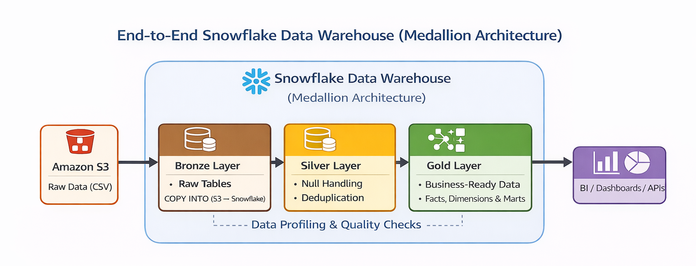

# Sales Data Warehouse using Snowflake (Medallion Architecture)

## Architecture Diagram

<p align="center" style="margin:0; padding:0;">
  
</p>

## Overview

This project implements an end-to-end **Data Warehouse (DWH)** using **Snowflake** and a **Medallion Architecture (Bronze, Silver, Gold)** design pattern.

The pipeline ingests raw data from Amazon S3, performs data profiling and cleansing, and builds a dimensional model (fact and dimension tables) to support business analytics and reporting.

---

## Architecture

```
S3 (Raw Data)
   ↓
BRONZE (Raw Ingestion Layer)
   ↓
SILVER (Cleansed & Standardized Layer)
   ↓
GOLD (Dimensional Model - Facts & Dimensions)
   ↓
MARTS (Business Aggregations)
```

---

## Layers Explained

### Bronze Layer

* Stores raw, source-aligned data
* Data is ingested from S3 using `COPY INTO`
* No transformations applied (schema-on-read style)

### Silver Layer

* Applies data cleaning and standardization:

  * Null handling
  * String normalization (TRIM, NULLIF, UPPER/LOWER)
  * Numeric precision alignment
  * Temporal validation
* Prepares data for modeling

### Gold Layer

* Implements **dimensional modeling (Star Schema)**:

  * Dimension tables: `DIM_CUSTOMER`, `DIM_PRODUCT`, `DIM_DATE`
  * Fact tables: `FACT_SALES_ORDER_HEADER`, `FACT_SALES_ORDER_DETAIL`
* Uses surrogate keys and maintains referential integrity

### Data Marts

* Aggregated datasets for business reporting:

  * Monthly sales
  * Product performance
  * Customer analytics

---

## Technologies Used

* Snowflake
* Amazon Web Services (S3 for storage)
* SQL (Snowflake SQL)

---

## Key Features

* Secure data ingestion using **Storage Integration (IAM Role)**
* External staging using S3
* Data profiling and quality validation
* Standardized transformation layer
* Star schema design for analytics
* Business-ready marts for reporting

---

## Project Structure

```
sql/
  01_SETUP.sql
  02_EXTERNAL_CONFIG.sql
  03_BRONZE+INGESTION.sql
  04_DATA_PROFILING.sql
  05_SILVER+TRANSFORMATION.sql
  06_GOLD_LAYER.sql
README.md
```

---

## Sample Business Use Cases

* Sales trend analysis (daily, monthly, yearly)
* Customer segmentation (new vs repeat customers)
* Product performance (top-selling products)
* Revenue and growth analysis
* Discount usage analysis

---

## Data Modeling Approach

* **Star Schema**
* Surrogate keys using `ROW_NUMBER()`
* Fact tables at defined grain:
  * Order-level (header)
  * Line-level (detail)
* Dimension tables provide descriptive context

---

## Key Learnings

* Designing end-to-end data pipelines using Snowflake
* Implementing medallion architecture in a real-world scenario
* Handling data quality issues before modeling
* Building scalable analytical models for BI consumption

---

## Future Improvements

* Add incremental loading (CDC / Streams & Tasks)
* Implement Snowpipe for real-time ingestion
* Add orchestration (Airflow / DBT)
* Introduce data quality monitoring layer
* Add dashboard (Power BI / Tableau)

---

## Author

**Ganasai Palakurthi** <br>
Data Engineer | Cloud | Snowflake | Spark <br>
Portfolio: https://ganasaipalakurthi.netlify.app/
